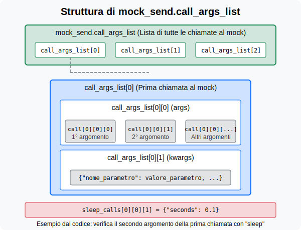

# Chi sono

### Mattia Furlani

- Solution architect @ Giunti
- Backend developer e Penetetration tester
- LinkedIn: https://www.linkedin.com/in/mattia-furlani/
- Email: mattia.furlani@protonmail.com

---

# Cosa è il Testing del software
Testare un software significa verificare che funzioni come previsto e che soddisfi i requisiti richiesti, in particolare tramite la scrittura di test automatici.
### Perchè è importante

- Aumenta la sicurezza dello sviluppatore nei confronti di nuove implementazioni o modifiche al codice
- Permette di individuare bug in tempo
- Documenta le funzionalità del software
- Promuove la scrittura di validazioni all'interno del codice (numeri negativi, stringhe vuote, ecc.)

---

# Esempio friggitrice

- Immaginiamo una funzione `send_to_fryer(operazione, argomenti)` che invia comandi a una friggitrice
- Il comando `heat` accetta solo "start" o "stop" e fa partire il riscaldamento
- Il comando `read_temperature` restituisce la temperatura attuale
- Il comando `sleep` fa partire un timer di X secondi

---

# Classe FrenchFryFryer

- **Classe FrenchFryFryer**:
  - Gestisce tutte le operazioni della friggitrice
  - Mantiene lo stato della friggitrice (temperatura, riscaldamento, presenza di patatine)
  - Controlla l'intero processo di frittura
- **Metodo cook_french_fries**:
  - Coordina l'intero processo di frittura
  - Riscalda l'olio, carica le patatine, frigge e spegne la friggitrice
  - Restituisce le patatine fritte come risultato

---

```python
class FrenchFryFryer:
    """Classe che gestisce la frittura delle patatine."""

    def __init__(self, target_temp: float = 180.0):
        """Inizializza la friggitrice per patatine."""
        self.target_temp = target_temp  # Temperatura target in gradi Celsius
        self.is_heating = False         # Se sta scaldando l'olio o meno
        self.potatoes_loaded = False    # Se le patatine sono caricate o meno

    #......

    def cook_french_fries(self, quantity, cooking_time) -> List[str]:
        """Processo completo di frittura delle patatine."""
        # Riscalda l'olio
        self.heat_oil()

        # Carica le patatine
        self.load_potatoes(quantity)

        # Friggi
        self.fry(cooking_time)

        # Spegni la friggitrice
        self.shutdown()

        # Rimuovi e restituisci le patatine
        return self.remove_fries()
```

---

# Metodo heat_oil

- **Funzionalità**:
  - Avvia il riscaldamento dell'olio verso la temperatura target
  - Monitora la temperatura corrente attraverso controlli periodici
  - Ha un numero massimo di tentativi per raggiungere la temperatura
- **Comportamento**:
  - Invia il comando "heat" con azione "start" alla friggitrice
  - Attende e controlla periodicamente la temperatura
  - Solleva un'eccezione se non raggiunge la temperatura target
  - Restituisce True se il riscaldamento è avvenuto con successo

---

```python
def heat_oil(self, max_attempts: int = 6) -> bool:
    """Riscalda l'olio fino alla temperatura target."""
    # Avvia il riscaldamento
    fryer.send_to_fryer("heat", {"action": "start"})
    self.is_heating = True

    # Controlla la temperatura fino a raggiungere quella target
    attempts = 0
    current_temp = self.check_temperature()

    while current_temp < self.target_temp and attempts < max_attempts:
        print(f"Riscaldamento in corso... Temperatura attuale: {current_temp:.1f}°C")
        fryer.send_to_fryer("sleep", {"seconds": 5})
        current_temp = self.check_temperature()
        attempts += 1

    # Verifica se la temperatura target è stata raggiunta
    if current_temp >= self.target_temp:
        print(f"Temperatura target raggiunta: {current_temp:.1f}°C")
        return True
    else:
        fryer.send_to_fryer("heat", {"action": "stop"})
        self.is_heating = False
        raise TimeoutError(f"Impossibile raggiungere la temperatura target dopo {max_attempts} tentativi")
```

---

# Metodo load_potatoes

- **Funzionalità**:
  - Carica una quantità specificata di patatine nella friggitrice
  - Verifica che la quantità sia valida (maggiore di zero e non eccessiva)
- **Controlli**:
  - Verifica che la quantità sia maggiore di zero
  - Verifica che la quantità non superi il limite massimo di 2 kg
- **Comportamento**:
  - Aggiorna lo stato della friggitrice indicando la presenza di patatine
  - Solleva un'eccezione se i parametri non sono validi

---

```python
def load_potatoes(self, quantity: float) -> None:
    """Carica le patatine nella friggitrice."""
    if quantity <= 0:
        raise ValueError("La quantità di patatine deve essere maggiore di zero")

    if quantity > 2.0:
        raise ValueError("Quantità massima di patatine: 2 kg")

    print(f"Caricamento di {quantity} kg di patatine nella friggitrice")
    self.potatoes_loaded = True
```

---

# Metodo fry

- **Funzionalità**:
  - Gestisce il processo di frittura per un tempo specificato
  - Verifica le condizioni necessarie per una corretta frittura
- **Controlli**:
  - Verifica che il riscaldamento sia attivo
  - Verifica che le patatine siano state caricate
  - Controlla che la temperatura sia adeguata (almeno 90% di quella target)
- **Comportamento**:
  - Avvia il timer per la frittura
  - Solleva eccezioni se le condizioni non sono adatte alla frittura

---

```python
def fry(self, frying_time: float = 180.0) -> None:
    """Frigge le patatine per il tempo specificato."""
    if not self.is_heating:
        raise RuntimeError("Il riscaldamento non è attivo")

    if not self.potatoes_loaded:
        raise RuntimeError("Nessuna patata caricata nella friggitrice")

    # Controlla che la temperatura sia vicina a quella target
    current_temp = self.check_temperature()
    if current_temp < self.target_temp * 0.9:  # 90% della temperatura target
        raise RuntimeError(f"Temperatura troppo bassa: {current_temp:.1f}°C")

    print(f"Inizio frittura delle patatine per {frying_time} secondi")

    fryer.send_to_fryer("sleep", {"seconds": frying_time})

    print("Frittura completata!")
```

---

# Metodi remove_fries e shutdown

- **Metodo remove_fries**:
  - Rimuove le patatine fritte dalla friggitrice
  - Verifica che ci siano patatine da rimuovere
  - Restituisce le patatine fritte come risultato
- **Metodo shutdown**:
  - Verifica lo stato attuale del riscaldamento
  - Invia il comando di spegnimento alla friggitrice se necessario

---

```python
def remove_fries(self) -> List[str]:
    """Rimuove le patatine dalla friggitrice."""
    if not self.potatoes_loaded:
        raise RuntimeError("Nessuna patata da rimuovere")

    print("Rimozione delle patatine dalla friggitrice")

    self.potatoes_loaded = False
    return ["🍟"] * 10

def shutdown(self) -> None:
    """Spegne la friggitrice."""
    if self.is_heating:
        fryer.send_to_fryer("heat", {"action": "stop"})
        self.is_heating = False
    print("Friggitrice spenta")
```

---

# Cosa possiamo testare?

- *Side effect* e valori di ritorno
- Validazione dei parametri e casi limite
- Quali funzioni vengono chiamate
- Se le eccezioni vengono sollevate correttamente
- Integrazione con altre parti del sistema

---

# Di che cosa?

- **Unit test**: testano una singola unità di codice (funzione o metodo)
- **Integration test**: testano l'integrazione tra più unità di codice
- **End to end test**: testano il sistema completo, dall'inizio alla fine
- **Regression test**: testano che bug precedentemente risolti non si ripresentino
- _System test_: testano il sistema in un ambiente di produzione
- _Acceptance test_: testano che il sistema soddisfi i requisiti del cliente

---

# Unit test per shutdown

```python
def shutdown(self) -> None:
    """Spegne la friggitrice."""
    if self.is_heating:
        fryer.send_to_fryer("heat", {"action": "stop"})
        self.is_heating = False
    print("Friggitrice spenta")
```

- Chiamare `shutdown` quando _is_heating_ è True
  - Controllare che _is_heating_ venga impostato su False
  - Assicurarsi che il comando di spegnimento venga inviato
- Chiamare `shutdown` quando _is_heating_ è False
  - Controllare che _is_heating_ rimanga False
  - Assicurarsi che il comando di spegnimento NON venga inviato
---
```python
import unittest
from main import FrenchFryFryer

class TestFrenchFryFryer(unittest.TestCase):
    """Test per la classe FrenchFryFryer."""
    
    def setUp(self):
        """Inizializza una nuova istanza di FrenchFryFryer prima di ogni test."""
        self.fryer = FrenchFryFryer()

    def test_shutdown(self):
        """Verifica che shutdown spenga il riscaldamento se è attivo."""
        self.fryer.is_heating = True
        self.fryer.shutdown()
        
        # Verifiche
        self.assertFalse(self.fryer.is_heating)
    
    def test_shutdown_already_off(self):
        """Verifica che shutdown non faccia nulla se il riscaldamento è già spento."""
        self.fryer.is_heating = False
        self.fryer.shutdown()
        
        # Verifiche
        self.assertFalse(self.fryer.is_heating)
```
---
# Mocking
#### Come faccio a verificare che il comando di spegnimento venga inviato?
- Devo usare un mock per la funzione `send_to_fryer`
- Un mock è un oggetto che simula il comportamento di un altro oggetto
- Permette di verificare se una funzione è stata chiamata e con quali argomenti
- Utile per testare funzioni che interagiscono con il mondo esterno (API, database, ecc.)
---
# Mocking
#### Come faccio a verificare che il comando di spegnimento venga inviato?
- La libreria standard di Python per il mocking è `unittest.mock`
- Il decoratore `@patch` permette di sostituire una funzione con un mock, il nome dell'oggetto mock viene passato come argomento al decoratore con questo formato: `posto_in_cui_viene_mockato.funzione_mockata`
---
```python
import unittest
from unittest.mock import patch
from main import FrenchFryFryer

class TestFrenchFryFryer(unittest.TestCase):
    """Test per la classe FrenchFryFryer."""
    
    def setUp(self):
        """Inizializza una nuova istanza di FrenchFryFryer prima di ogni test."""
        self.fryer = FrenchFryFryer()

    @patch('main.send_to_fryer') # Rimpiazza la funzione send_to_fryer con un mock
    def test_shutdown(self, mock_send):
        """Verifica che shutdown spenga il riscaldamento se è attivo."""
        self.fryer.is_heating = True
        self.fryer.shutdown()
        
        # Verifiche
        mock_send.assert_called_once_with("heat", {"action": "stop"})
        self.assertFalse(self.fryer.is_heating)
    
    @patch('main.send_to_fryer') # Rimpiazza la funzione send_to_fryer con un mock
    def test_shutdown_already_off(self, mock_send):
        """Verifica che shutdown non faccia nulla se il riscaldamento è già spento."""
        self.fryer.is_heating = False
        self.fryer.shutdown()
        mock_send.assert_not_called()
```
---
# Mocking
- Possiamo anche verificare molte altre cose:
  - Se una funzione è stata chiamata un certo numero di volte
  - Se una funzione è stata chiamata con argomenti specifici
  - Se una funzione è stata chiamata in un certo ordine
  - ...
---
Testiamo anche la frittura delle patatine, controllando gli errori e le chiamate al mock
```python
def check_temperature(self) -> float:
    """Controlla la temperatura attuale della friggitrice."""
    return send_to_fryer("read_temperature")

def fry(self, frying_time: float = 180.0) -> None:
    """Frigge le patatine per il tempo specificato."""
    if not self.is_heating:
        raise RuntimeError("Il riscaldamento non è attivo")
        
    if not self.potatoes_loaded:
        raise RuntimeError("Nessuna patata caricata nella friggitrice")
    
    # Controlla che la temperatura sia vicina a quella target
    current_temp = self.check_temperature()
    if current_temp < self.target_temp * 0.9:  # 90% della temperatura target
        raise RuntimeError(f"Temperatura troppo bassa: {current_temp:.1f}°C")
    
    print(f"Inizio frittura delle patatine per {frying_time} secondi")
    send_to_fryer("sleep", {"seconds": frying_time})
    print("Frittura completata!")
```
---
```python
@patch('main.send_to_fryer')  
def test_fry_no_heating(self, mock_send):
    """Verifica che fry sollevi un'eccezione quando il riscaldamento non è attivo."""
    # Setup
    self.fryer.is_heating = False
    self.fryer.potatoes_loaded = True
    
    # Esecuzione e verifica
    with self.assertRaises(RuntimeError):
        self.fryer.fry()
        
    # Verify no calls to send_to_fryer were made
    mock_send.assert_not_called()

@patch('main.send_to_fryer')  
def test_fry_temperature_too_low(self, mock_send):
    """Verifica che fry sollevi un'eccezione quando la temperatura è troppo bassa."""
    # Setup
    self.fryer.is_heating = True
    self.fryer.potatoes_loaded = True
    mock_send.return_value = 100.0  # Temperatura troppo bassa
    
    # Esecuzione e verifica
    with self.assertRaises(RuntimeError):
        self.fryer.fry()
```
---
```python
@patch('main.send_to_fryer')  
def test_fry_success(self, mock_send):
    """Verifica che fry funzioni correttamente quando tutto è pronto."""
    # Setup
    self.fryer.is_heating = True
    self.fryer.potatoes_loaded = True
    # Simula una temperatura superiore a quella target
    def mock_read_temperature(action, args=None):
        if action == "read_temperature":
            return 180.0
        return None
    mock_send.side_effect = mock_read_temperature
    
    # Esecuzione
    self.fryer.fry(frying_time=0.1)  # Riduci il tempo per velocizzare il test
    
    # Verifico che sia stato chiamato send_to_fryer solo una volta con "sleep"
    # e che il tempo di attesa sia corretto
    sleep_calls = [call for call in mock_send.call_args_list if call[0][0] == "sleep"]
    self.assertEqual(len(sleep_calls), 1)
    self.assertEqual(sleep_calls[0][0][1], {"seconds": 0.1})
```
---
```python
def function(args, **kwargs):
```


---
# Integration test
- Testano l'integrazione tra più unità di codice
- Verificano che le unità funzionino correttamente insieme
- Le unità possono essere funzioni, classi o applicazioni
- Nel nostro caso la funzione `cook_french_fries` è un buon candidato per un test di integrazione
---
```python
@patch('main.send_to_fryer')
def test_complete_frying_process(self, mock_send):
    """
    Test di integrazione che verifica l'intero processo di frittura
    con una simulazione realistica delle risposte della friggitrice.
    """
    # Simula risposte realistiche della friggitrice
    temperature_sequence = [25.0, 100.0, 150.0, 179.0, 182.0, 181.0]
    current_temp_index = 0
    
    def mock_send_to_fryer(action, args=None):
        nonlocal current_temp_index
        
        if action == "read_temperature":
            temp = temperature_sequence[min(current_temp_index, len(temperature_sequence) - 1)]
            current_temp_index += 1
            return temp
        elif action == "sleep":
            # Non attendere realmente durante i test
            return None
        elif action == "heat":
            return None
```
---
```python
    mock_send.side_effect = mock_send_to_fryer
    
    # Crea l'istanza della friggitrice
    fryer = FrenchFryFryer(target_temp=180.0)
    
    # Esegui il processo completo
    fries = fryer.cook_french_fries(quantity=1.0, cooking_time=3.0)
    
    # Verifica i risultati
    self.assertEqual(len(fries), 10)
    self.assertEqual(fries[0], "🍟")
    
    # Verifica la sequenza di chiamate alla friggitrice
    call_actions = [call[0][0] for call in mock_send.call_args_list]
    
    # Verifica che le azioni principali siano state chiamate nell'ordine corretto
    self.assertEqual(call_actions[0], "heat")  # Avvio riscaldamento
    self.assertIn("read_temperature", call_actions)  # Controllo temperatura
    self.assertIn("sleep", call_actions)  # Attesa durante la frittura
    self.assertEqual(call_actions[-1], "heat")  # Spegnimento finale
```
---
## E se volessi scrivere uno unit test per cook_french_fries?
```python
@patch.object(FrenchFryFryer, 'heat_oil')
@patch.object(FrenchFryFryer, 'load_potatoes')
@patch.object(FrenchFryFryer, 'fry')
@patch.object(FrenchFryFryer, 'remove_fries')
@patch.object(FrenchFryFryer, 'shutdown')
def test_cook_french_fries_success(self, mock_shutdown, mock_remove, mock_fry, mock_load, mock_heat):
    """Verifica che cook_french_fries completi correttamente l'intero processo."""
    # Setup
    mock_remove.return_value = ["🍟"] * 10
    
    # Esecuzione
    result = self.fryer.cook_french_fries(quantity=1.0, cooking_time=10.0)
    
    # Verifiche
    mock_heat.assert_called_once()
    mock_load.assert_called_once_with(1.0)
    mock_fry.assert_called_once_with(10.0)
    mock_remove.assert_called_once()
    # The shutdown is called at the end
    mock_shutdown.assert_called_once()
    self.assertEqual(len(result), 10)
    self.assertEqual(result[0], "🍟")
```
---
# End to end test
- Testano l'intero sistema, dall'inizio alla fine
- Utili per API, interfacce utente e sistemi complessi
- In base al sistema da testare esistono più strumenti.
- Ad esempio:
  - Cypress per le interfacce utente
  - Postman per le API (la maggior parte dei framework e linguaggi hanno il loro modo di fare e2e test)
---
# Scrivere codice testabile
- **Separazione delle responsabilità**
- Scrivere codice modulare e riutilizzabile
- Scrivere codice che non dipenda da altri sistemi
- Limitare le funzioni con side effects e la loro dimensione
- Usare mocking e stub per simulare il comportamento di altri sistemi
---
## Scrivere codice testabile

```python
# Difficilmente testabile!
def calcola_sconto_cliente(id_cliente):
    # Connessione diretta al database
    conn = sqlite3.connect('database.db')
    cursor = conn.cursor()
    
    # Query per ottenere lo storico acquisti
    cursor.execute("SELECT SUM(importo) FROM ordini WHERE id_cliente = ? AND data > ?", 
                  (id_cliente, datetime.now() - timedelta(days=365)))
    totale_annuale = cursor.fetchone()[0] or 0
    
    # Logica di business mescolata con accesso ai dati
    if totale_annuale > 10000:
        sconto = 0.20  # 20% di sconto
    elif totale_annuale > 5000:
        sconto = 0.10  # 10% di sconto
    elif totale_annuale > 1000:
        sconto = 0.05  # 5% di sconto
    else:
        sconto = 0
        
    conn.close()
    return sconto
```
---
# Perchè è difficile testarlo?
- Contiene accesso diretto al database
- Usa la data corrente (non deterministica)
- Mescola recupero dati e logica di business in un'unica funzione
---
## Come spezzare il codice in funzioni testabili?
```python
# 1. Funzione pura che calcola lo sconto (facilmente testabile)
def calcola_percentuale_sconto(totale_annuale):
    """Calcola la percentuale di sconto basata sul totale degli acquisti."""
    if totale_annuale > 10000:
        return 0.20  # 20% di sconto
    elif totale_annuale > 5000:
        return 0.10  # 10% di sconto
    elif totale_annuale > 1000:
        return 0.05  # 5% di sconto
    else:
        return 0

# 2. Funzione che ottiene il totale annuale (testabile con mock del database)
def get_totale_acquisti_annuali(conn, id_cliente, data_riferimento):
    """Recupera il totale degli acquisti dell'ultimo anno per un cliente."""
    data_inizio = data_riferimento - timedelta(days=365)
    cursor = conn.cursor()
    cursor.execute(
        "SELECT SUM(importo) FROM ordini WHERE id_cliente = ? AND data > ?", 
        (id_cliente, data_inizio)
    )
    totale = cursor.fetchone()[0]
    return totale or 0
```
---
## Come spezzare il codice in funzioni testabili?
```python
# 3. Funzione principale che coordina le altre (testabile con dependency injection)
def calcola_sconto_cliente_testabile(id_cliente, 
                                    db_connector=sqlite3.connect, 
                                    data_riferimento=None):
    """Calcola lo sconto per un cliente specifico."""
    if data_riferimento is None:
        data_riferimento = datetime.now()
        
    conn = db_connector('database.db')
    try:
        totale = get_totale_acquisti_annuali(conn, id_cliente, data_riferimento)
        sconto = calcola_percentuale_sconto(totale)
        return sconto
    finally:
        conn.close()
```
---
# Cosa devo testare?
- In base al progetto, alla sua complessità e alla sua importanza posso individuare quali funzioni testare
- Non è necessario testare ogni singola funzione o casistica, ma è importante testare le parti più critiche e che più probabilmente saranno soggette a modifiche
- Le dinamiche di impresa influiscono su questo aspetto, il tempo da dedicare al testing viene spesso ridotto a favore di nuove funzionalità
- In contesti collaborativi diventa più importante, il testing permette di evitare che modifiche al codice di un collega possano rompere il mio
- È importante anche per facilitare futuri cambiamenti al codice, il testing permette di avere una base solida su cui lavorare
---
# Cosa devo testare?
- Nel caso di una friggitrice è importante che non continui a scaldare l'olio se non serve in quanto è pericoloso
- Può essere inoltre utile scrivere qualche integration test per verificare che il processo di frittura funzioni correttamente
- Anche la funzione heat_oil è un buon candidato per degli unit test, in quanto è una funzione critica e complessa
---
# Come vengono eseguiti i test nel mondo reale?
## La Continuous Integration
- La **Continuos Integration** (o CI) è un processo che permette di automatizzare il rilascio del software, strettamente legato al controllo di versione (Git)
- In base al provider (GitHub, GitLab, Bitbucket, ecc.) ci sono strumenti diversi per la CI
- In GitHub ad esempio si usano le **GitHub Actions**, che permettono di eseguire script in risposta a eventi (push, pull request, ecc.)
---
# Come vengono eseguiti i test nel mondo reale?
- Le Github Actions vengono usate tipicamente per definire una Pipeline di CI strutturata nella seguente maniera:
  - **Build**: costruisce il progetto (compila il codice, crea i pacchetti, ecc.)
  - **Test**: esegue i test automatici
  - **Release**: rilascia il software (pubblica i pacchetti, anche privatamente)
- Se ci sono errori in uno dei passaggi la pipeline fallisce e il codice non viene rilasciato